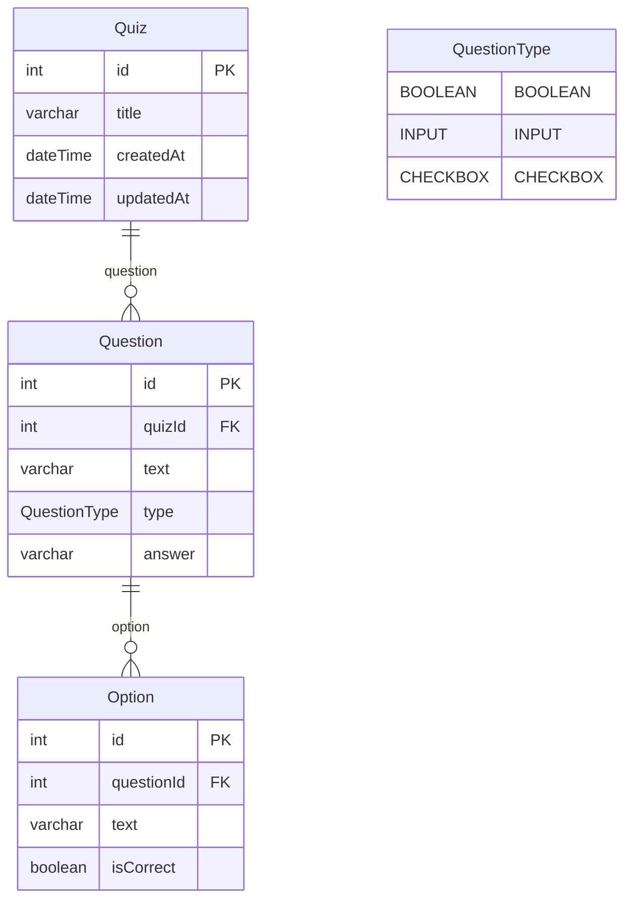

# The **Quiz Builder**

## **Overview**

This task is to implement a **Quiz Builder** web application where users can create custom quizzes with various types of questions. The application consists of a **Backend** (Node.js) and **Frontend** (React). Users should be able to build quizzes, view all available quizzes, and view any single quiz in detail.

---

## **Objective**

Build a full-stack quiz creation platform where:

- A user can create a quiz with multiple question types
- All quizzes are listed in a dashboard
- Each quiz can be viewed in a separate page

---
## Getting Started

Follow these steps to run the backend and frontend of the project locally.

1. Clone the repository
Make sure you have the project on your machine:

```
git clone <repository-url>
cd <repository-folder>
```

2. Setup the Backend
Navigate to the backend folder:

```
cd backend
```

Create a .env file in the backend folder with the following content:

```
PORT=3000
DATABASE_URL="file:./dev.db"

SWAGGER_TITLE=Helloworld
SWAGGER_DESCRIPTION=Yes
SWAGGER_VERSION=1.0
SWAGGER_TAG=quiz-builder
```

Make sure the path to the database (dev.db) is correct.
Install backend dependencies:
```
npm install
# or
yarn
# or
pnpm install
```

Run the backend development server:
```
npm run start:dev
# or
yarn start:dev
# or
pnpm start:dev
```

The backend should now be running at http://localhost:3000.

3. Setup the Frontend
Navigate to the frontend folder:
```
cd frontend
Install frontend dependencies:
npm install
# or
yarn
# or
pnpm install
```

Run the frontend development server:
```
npm run dev
# or
yarn dev
# or
pnpm dev
```

The frontend should now be running at http://localhost:3001 (or the port defined in your frontend config).
4. Access the Application
Frontend: http://localhost:<frontend-port>
Backend Swagger Docs: http://localhost:3000/api (if Swagger is enabled)

## **Backend**

**Tech Stack:**

- Node.js (Nest.js)
- TypeScript
- SQLite (via Prisma)

**Endpoints:**

1. `POST /quizzes` – Create a new quiz
2. `GET /quizzes` – Return a list of all quizzes with titles and number of questions
3. `GET /quizzes/:id` – Return full details of a quiz including all questions
4. `DELETE /quizzes/:id` – Delete a quiz

## Database Schema

---

## **Frontend**

**Tech Stack:**

- Next.js
- TypeScript

### **Pages**

### **1. Quiz Creation Page (`/create`)**

- Form to add:
    - Quiz title
    - One or more questions
- **Supported Question Types:**
    - **Boolean**: True/False radio buttons
    - **Input**: Short text answer
    - **Checkbox**: Multiple choice with several correct answers
- Ability to dynamically add/remove questions
- Submit form to POST `/quizzes`

### **2. Quiz List Page (`/quizzes`)**

- Fetch from `GET /quizzes`
- Display quiz title and number of questions
- Each item should link to the quiz details page
- Each item should have a delete icon when the user clicks on it to delete the quiz from the database (`DELETE /quizzes/:id`) and from the page

### **3. Quiz Detail Page (`/quizzes/:id`)**

- Fetch quiz from `GET /quizzes/:id`
- Display title and questions
- Render questions in read-only mode (not for solving, just structure)

## **Project Structure**

```
quiz-builder/
├── backend/         # Express/NestJS app
│   ├── src/
│   └── prisma/ or models/
├── frontend/        # React/Next.js app
│   ├── pages/
│   ├── components/
│   └── services/
└── README.md

```
